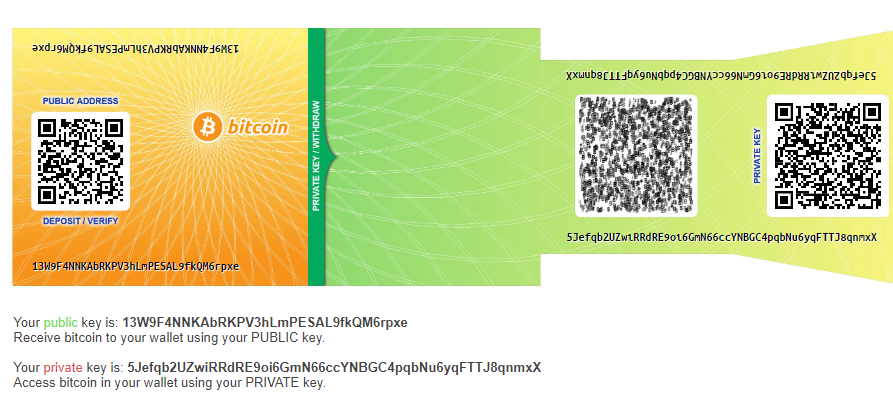
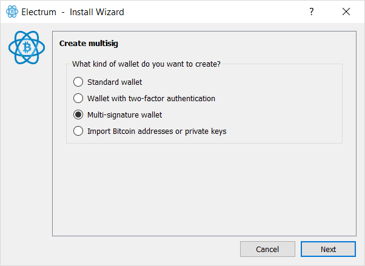
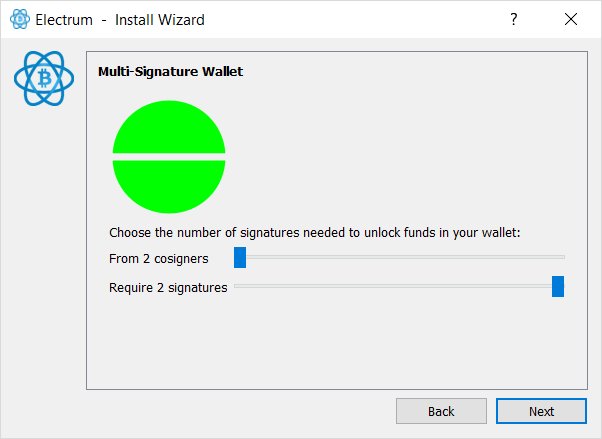
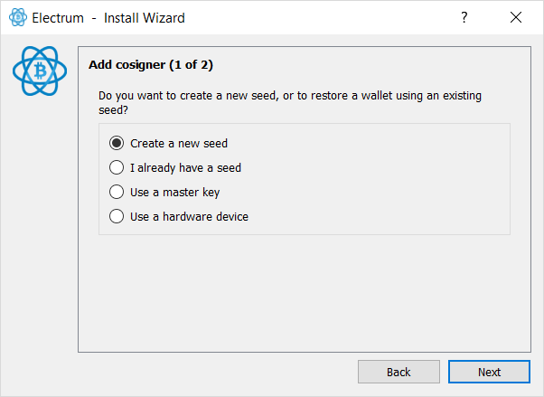
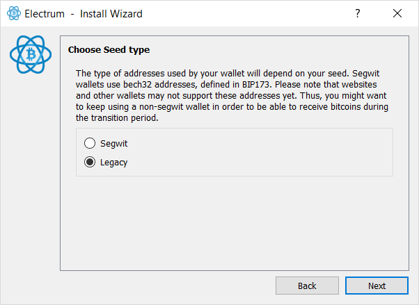
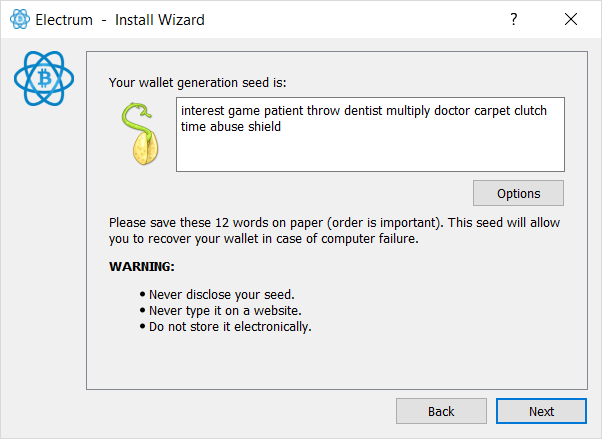
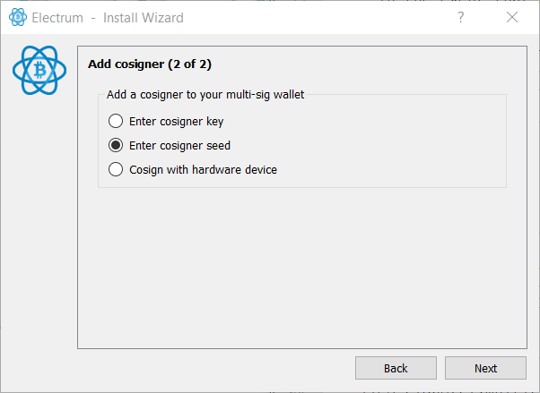
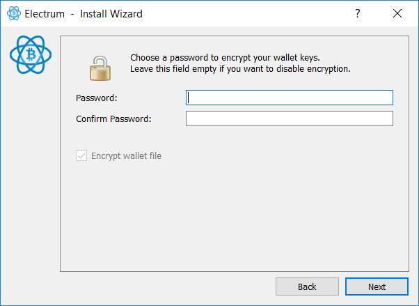
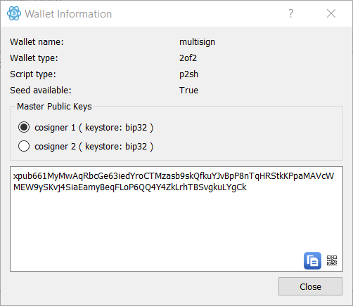

# Module 3 - Intermediate Lab: Securing your Bitcoin Wallet
## Background
Bitcoin is a way for people to store monetary value into a digital asset. Like banks, this money needs to be protected in some way. The complete wealth of every Bitcoin is protected by the blockchain's concensus model. However, as an individual, you need to be aware of the security risks that are posed when storing Bitcoin. This lab will go over different ways of storing your Bitcoins. 

## Meta Information

| Attribute | Explanation |
| - | - |
| Summary | This lab will explore a variety of ways of storing Bitcoin. |
| Topics  | Bitcoin, security, encryption, hardware, cryptography |
| Audience | CS1 and above. |
| Difficulty | Intermedidate |
| Strengths | The topic is easy to follow |
| Weaknesses | Some material mentions commercial products, which may cost money to use. |
| Dependencies | A computer with internet access and a suitable browser. |
| Variants | This lab may be used for the security management of other wallets that host cryptocurrencies that are not necessarily Bitcoin. |

## Assignment Instructions
1. Physical Bitcoin Storage
	* Physical Bitcoin wallets are also called paper wallets. They are often called "paper" wallets because they are printed onto paper with a QR code containing a public key and/or the private key of a bitcoin address. 
	* Go to https://bitcoinpaperwallet.com
	* Click on "Generate & Print Paper Wallets"
	* Move your mouse around without any patterns and/or type on the input box provided. This is done to create entropy to create the wallet.
	
	* *_Careful: There are a few potential problems with this method._*
		* Printing the wallet's private key may remain stored in the printer's cache, vulnerable to be found by someone. 
	
		* Promotes address reuse which could cause privacy issues, as your wallet's balance is public on the blockchain. 
	
		* The wallet is susceptible to physical damage, and if there are no multiple backups, you may lose access to your Bitcoins.
	
2. Hardware Wallets
	* Hardware wallets are the step-up from paper wallets. They are devices that often look like USBs whose sole purpose is to keep Bitcoin wallets safe. They offer a variety of security features:
	* Private keys are often stored in a protected area of the microcontroller and thus cannot be transferred out of the device in plaintext.
	* They are immune to specifically-designed viruses that steal software wallets.
	* Private keys never need to touch potentially vulnerable software
	* Open source hardware wallets allow the user to validate the operation of the device.
	* *_Careful: There are a few potential problems with this method._*
		* One, malware could swap the recipient Bitcoin address. While hardware keys can protect your private keys, they may not be able to protect you against the wrong recipient address.
	
		* Two, insecure Random Number Generators embedded on a hardware wallet could allow an attacker to re-create the private keys you've created and drain the funds.
	
		* Three, like with all software and hardware, bugs and exploits could allow an attacker to compromise your wallet.
	
		* Four, bad actors in a production process could compromise wallets, even if the software and hardware were to be perfect. Hardware and software backdoors are certainly a possibility.
	
		* Five, bad actors in a shipping process could replace secure products with insecure ones. 
3. Balancing Risk
	* If you secure your bitcoin behind too many layers of security, you might end up locking yourself out. Respect every layer of security, because losing one could mean losing everything. 

4. Diversifying Risk
	* In the above scenario, it was assumed that you kept all your Bitcoins in one wallet. However, this bad practice. Would you carry your life savings in your wallet? Probably not. It's the same in Bitcoin. A good amount to keep per wallet is 5%, this way, if your wallet is lost through malware, or user error, you don't lose everything. 

5. Multisig and Governance 
	* In the event that a wallet is shared by a group of individuals, one can create a multi-signature wallet so that transactions require more than one person to spend funds. 
	* In this tutorial, we will be using [Electrum](https://Electrum.org)
	* First, we'll create a wallet. (You should know how to make one from the previous lab. Remember the seed.) 
	* Next, we'll create another wallet using Electrum, but this time it will be with multi-signature features.
	* When you open Electrum again, you might get asked for the password of the first wallet you made. Since we're going to create a new wallet, type in a different name and the wizard should begin.
	
	
	* This time, instead of creating a standard wallet, we're going to create a multi-signature wallet. Change the option accordingly.
	
	
	* Next, we need to set the number of co-signers. This is the total number of people that the wallet will be shared by. The signature requirement can only be equal or less than the number of co-signers. This means that for example, in a group of 10 co-signers and 3 required signatures, you'd only need any 3 people from the total 10 to make a transaction. You can make this as strict as possible and require 10 people out of 10 to sign before making a transaction happen, for example. 
	
	
	* The wizard will then ask you about creating a new seed. You can do so in this screen if you haven't created more than one wallet yet. 
	
	
	* We want this wallet to work no matter what, so we're going to keep Legacy support. 
	
	
	* Remember the seed, as it is the only way you can recover your wallet. You will also be asked to type it in again in the next prompt.
	
	
	* You will be shown your public key, save it along the seed. 
	* Afterward, you will have to add the second co-signer. Use the seed from the wallet you created in the beginner lab (not the one from the previous prompts) 
	
	
	* Create a password to encrypt your wallet within Electrum.
	
	
	* Electrum should open to the wallet GUI, double check that the multi-signature wallet was successfully created by going into Wallet -> Information.
	
	
	
	* Congratulations, you have created a multi-signature wallet.

## Credits
Dr. Debasis Bhattacharya  
Mario Canul  
Saxon Knight  